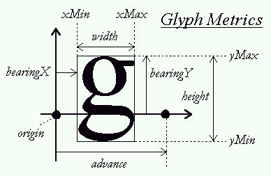
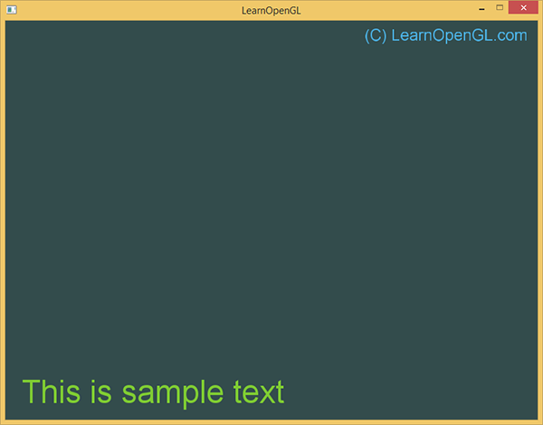
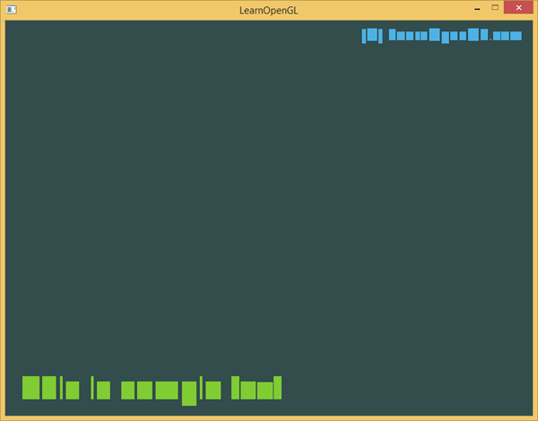

# 文本渲染

原文     | [Text Rendering](http://learnopengl.com/#!In-Practice/Text-Rendering)
      ---|---
作者     | JoeyDeVries
翻译     | [Geequlim](http://geequlim.com)
校对     | gjy_1992, [BLumia](https://github.com/blumia/)

当你在图形计算领域冒险到了一定阶段以后你可能会想使用OpenGL来绘制文本。然而，可能与你想象的并不一样，使用像OpenGL这样的底层库来把文本渲染到屏幕上并不是一件简单的事情。如果你只需要绘制128种不同的字符(Character)，那么事情可能会简单一些。但是如果你要绘制的字符有着不同的宽、高和边距，事情马上就复杂了。根据你使用语言的不同，你可能会需要多于128个字符。再者，如果你要绘制音乐符、数学符号这些特殊的符号；或者渲染竖排文本呢？一旦你把文本这些复杂的情况考虑进来，你就不会奇怪为什么OpenGL这样的底层API没有包含文本处理了。

由于OpenGL本身并没有包含任何的文本处理能力，我们必须自己定义一套全新的系统让OpenGL绘制文本到屏幕上。由于文本字符没有图元，我们必须要有点创造力才行。需要使用的一些技术可以是：通过<var>GL_LINES</var>来绘制字形，创建文本的3D网格(Mesh)，或在3D环境中将字符纹理渲染到2D四边形上。

开发者最常用的一种方式是将字符纹理绘制到四边形上。绘制这些纹理四边形本身其实并不是很复杂，然而检索要绘制文本的纹理却变成了一项有挑战性的工作。本教程将探索多种文本渲染的实现方法，并且使用FreeType库实现一个更加高级但更灵活的渲染文本技术。

## 经典文本渲染：位图字体

早期的时候，渲染文本是通过选择一个需要的字体(Font)（或者自己创建一个），并提取这个字体中所有相关的字符，将它们放到一个单独的大纹理中来实现的。这样一张纹理叫做<def>位图字体</def>(Bitmap Font)，它在纹理的预定义区域中包含了我们想要使用的所有字符。字体的这些字符被称为<def>字形</def>(Glyph)。每个字形都关联着一个特定的纹理坐标区域。当你想要渲染一个字符的时候，你只需要通过渲染这一块特定的位图字体区域到2D四边形上即可。


你可以看到，我们取一张位图字体，（通过仔细选择纹理坐标）从纹理中采样对应的字形，并渲染它们到多个2D四边形上，最终渲染出“OpenGL”文本。通过启用[混合](../04 Advanced OpenGL/03 Blending.md)，让背景保持透明，最终就能渲染一个字符串到屏幕上。这个位图字体是通过Codehead的位图[字体生成器](http://www.codehead.co.uk/cbfg/)生成的。

使用这种方式绘制文本有许多优势也有很多缺点。首先，它相对来说很容易实现，并且因为位图字体已经预光栅化了，它的效率也很高。然而，这种方式不够灵活。当你想要使用不同的字体时，你需要重新编译一套全新的位图字体，而且你的程序会被限制在一个固定的分辨率。如果你对这些文本进行缩放的话你会看到文本的像素边缘。此外，这种方式通常会局限于非常小的字符集，如果你想让它来支持Extended或者Unicode字符的话就很不现实了。

这种绘制文本的方式曾经得益于它的高速和可移植性而非常流行，然而现在已经出现更加灵活的方式了。其中一个是我们即将讨论的使用FreeType库来加载TrueType字体的方式。

## 现代文本渲染：FreeType

FreeType是一个能够用于加载字体并将他们渲染到位图以及提供多种字体相关的操作的软件开发库。它是一个非常受欢迎的跨平台字体库，它被用于Mac OS X、Java、PlayStation主机、Linux、Android等平台。FreeType的真正吸引力在于它能够加载TrueType字体。

TrueType字体不是用像素或其他不可缩放的方式来定义的，它是通过数学公式（曲线的组合）来定义的。类似于矢量图像，这些光栅化后的字体图像可以根据需要的字体高度来生成。通过使用TrueType字体，你可以轻易渲染不同大小的字形而不造成任何质量损失。

FreeType可以在他们的[官方网站](http://www.freetype.org/)中下载到。你可以选择自己用源码编译这个库，如果支持你的平台的话，你也可以使用他们预编译好的库。请确认你将**freetype.lib**添加到你项目的链接库中，并且确认编译器知道头文件的位置。

然后请确认包含合适的头文件：

```cpp
#include <ft2build.h>
#include FT_FREETYPE_H  
```

!!! attention
    
    由于FreeType的开发方式（至少在我写这篇文章的时候），你不能将它们的头文件放到一个新的目录下。它们应该保存在你include目录的根目录下。通过使用像 `#include <FreeType/ft2build.h>` 这样的方式导入FreeType可能会出现一些头文件冲突的问题。

FreeType所做的事就是加载TrueType字体并为每一个字形生成位图以及计算几个度量值(Metric)。我们可以提取出它生成的位图作为字形的纹理，并使用这些度量值定位字符的字形。

要加载一个字体，我们只需要初始化FreeType库，并且将这个字体加载为一个FreeType称之为<def>面</def>(Face)的东西。这里为我们加载一个从**Windows/Fonts**目录中拷贝来的TrueType字体文件**arial.ttf**。

```cpp
FT_Library ft;
if (FT_Init_FreeType(&ft))
    std::cout << "ERROR::FREETYPE: Could not init FreeType Library" << std::endl;

FT_Face face;
if (FT_New_Face(ft, "fonts/arial.ttf", 0, &face))
    std::cout << "ERROR::FREETYPE: Failed to load font" << std::endl;
```

这些FreeType函数在出现错误时将返回一个非零的整数值。

当面加载完成之后，我们需要定义字体大小，这表示着我们要从字体面中生成多大的字形：

```cpp
FT_Set_Pixel_Sizes(face, 0, 48);  
```
此函数设置了字体面的宽度和高度，将宽度值设为0表示我们要从字体面通过给定的高度中动态计算出字形的宽度。

一个FreeType面中包含了一个字形的集合。我们可以调用<fun>FT_Load_Char</fun>函数来将其中一个字形设置为激活字形。这里我们选择加载字符字形'X'：

```cpp
if (FT_Load_Char(face, 'X', FT_LOAD_RENDER))
    std::cout << "ERROR::FREETYTPE: Failed to load Glyph" << std::endl;
```

通过将<var>FT_LOAD_RENDER</var>设为加载标记之一，我们告诉FreeType去创建一个8位的灰度位图，我们可以通过`face->glyph->bitmap`来访问这个位图。

使用FreeType加载的每个字形没有相同的大小（不像位图字体那样）。使用FreeType生成的位图的大小恰好能包含这个字符可见区域。例如生成用于表示'.'的位图的大小要比表示'X'的小得多。因此，FreeType同样也加载了一些度量值来指定每个字符的大小和位置。下面这张图展示了FreeType对每一个字符字形计算的所有度量值。



每一个字形都放在一个水平的<def>基准线</def>(Baseline)上（即上图中水平箭头指示的那条线）。一些字形恰好位于基准线上（如'X'），而另一些则会稍微越过基准线以下（如'g'或'p'）（译注：即这些带有下伸部的字母，可以见[这里](https://www.supremo.tv/typeterms/)）。这些度量值精确定义了摆放字形所需的每个字形距离基准线的偏移量，每个字形的大小，以及需要预留多少空间来渲染下一个字形。下面这个表列出了我们需要的所有属性。

属性|获取方式|生成位图描述
---|---|---
**width**   | `face->glyph->bitmap.width` | 位图宽度（像素）
**height**  | `face->glyph->bitmap.rows`  | 位图高度（像素）
**bearingX** | `face->glyph->bitmap_left` | 水平距离，即位图相对于原点的水平位置（像素）
**bearingY** | `face->glyph->bitmap_top` | 垂直距离，即位图相对于基准线的垂直位置（像素）
**advance** | `face->glyph->advance.x`  | 水平预留值，即原点到下一个字形原点的水平距离（单位：1/64像素）

在需要渲染字符时，我们可以加载一个字符字形，获取它的度量值，并生成一个纹理，但每一帧都这样做会非常没有效率。我们应将这些生成的数据储存在程序的某一个地方，在需要渲染字符的时候再去调用。我们会定义一个非常方便的结构体，并将这些结构体存储在一个<fun>map</fun>中。

```cpp
struct Character {
    GLuint     TextureID;  // 字形纹理的ID
    glm::ivec2 Size;       // 字形大小
    glm::ivec2 Bearing;    // 从基准线到字形左部/顶部的偏移值
    GLuint     Advance;    // 原点距下一个字形原点的距离
};

std::map<GLchar, Character> Characters;
```

对于这个教程来说，本着让一切简单的目的，我们只生成ASCII字符集的前128个字符。对每一个字符，我们生成一个纹理并保存相关数据至<fun>Character</fun>结构体中，之后再添加至<var>Characters</var>这个映射表中。这样子，渲染一个字符所需的所有数据就都被储存下来备用了。

```cpp
glPixelStorei(GL_UNPACK_ALIGNMENT, 1); //禁用字节对齐限制
for (GLubyte c = 0; c < 128; c++)
{
    // 加载字符的字形 
    if (FT_Load_Char(face, c, FT_LOAD_RENDER))
    {
        std::cout << "ERROR::FREETYTPE: Failed to load Glyph" << std::endl;
        continue;
    }
    // 生成纹理
    GLuint texture;
    glGenTextures(1, &texture);
    glBindTexture(GL_TEXTURE_2D, texture);
    glTexImage2D(
        GL_TEXTURE_2D,
        0,
        GL_RED,
        face->glyph->bitmap.width,
        face->glyph->bitmap.rows,
        0,
        GL_RED,
        GL_UNSIGNED_BYTE,
        face->glyph->bitmap.buffer
    );
    // 设置纹理选项
    glTexParameteri(GL_TEXTURE_2D, GL_TEXTURE_WRAP_S, GL_CLAMP_TO_EDGE);
    glTexParameteri(GL_TEXTURE_2D, GL_TEXTURE_WRAP_T, GL_CLAMP_TO_EDGE);
    glTexParameteri(GL_TEXTURE_2D, GL_TEXTURE_MIN_FILTER, GL_LINEAR);
    glTexParameteri(GL_TEXTURE_2D, GL_TEXTURE_MAG_FILTER, GL_LINEAR);
    // 储存字符供之后使用
    Character character = {
        texture, 
        glm::ivec2(face->glyph->bitmap.width, face->glyph->bitmap.rows),
        glm::ivec2(face->glyph->bitmap_left, face->glyph->bitmap_top),
        face->glyph->advance.x
    };
    Characters.insert(std::pair<GLchar, Character>(c, character));
}
```

在这个for循环中我们遍历了ASCII集中的全部128个字符，并获取它们对应的字符字形。对每一个字符，我们生成了一个纹理，设置了它的选项，并储存了它的度量值。有趣的是我们这里将纹理的`internalFormat`和`format`设置为<var>GL_RED</var>。通过字形生成的位图是一个8位灰度图，它的每一个颜色都由一个字节来表示。因此我们需要将位图缓冲的每一字节都作为纹理的颜色值。这是通过创建一个特殊的纹理实现的，这个纹理的每一字节都对应着纹理颜色的红色分量（颜色向量的第一个字节）。如果我们使用一个字节来表示纹理的颜色，我们需要注意OpenGL的一个限制：

```cpp
glPixelStorei(GL_UNPACK_ALIGNMENT, 1);   
```

OpenGL要求所有的纹理都是4字节对齐的，即纹理的大小永远是4字节的倍数。通常这并不会出现什么问题，因为大部分纹理的宽度都为4的倍数并/或每像素使用4个字节，但是现在我们每个像素只用了一个字节，它可以是任意的宽度。通过将纹理解压对齐参数设为1，这样才能确保不会有对齐问题（它可能会造成段错误）。

当你处理完字形后不要忘记清理FreeType的资源。

```cpp
FT_Done_Face(face);
FT_Done_FreeType(ft);
```

### 着色器

我们将使用下面的顶点着色器来渲染字形：

```cpp
#version 330 core
layout (location = 0) in vec4 vertex; // <vec2 pos, vec2 tex>
out vec2 TexCoords;

uniform mat4 projection;

void main()
{
    gl_Position = projection * vec4(vertex.xy, 0.0, 1.0);
    TexCoords = vertex.zw;
}
```

我们将位置和纹理纹理坐标的数据合起来存在一个<fun>vec4</fun>中。这个顶点着色器将位置坐标与一个投影矩阵相乘，并将纹理坐标传递给片段着色器：

```cpp
#version 330 core
in vec2 TexCoords;
out vec4 color;

uniform sampler2D text;
uniform vec3 textColor;

void main()
{    
    vec4 sampled = vec4(1.0, 1.0, 1.0, texture(text, TexCoords).r);
    color = vec4(textColor, 1.0) * sampled;
}
```

片段着色器有两个uniform变量：一个是单颜色通道的字形位图纹理，另一个是颜色uniform，它可以用来调整文本的最终颜色。我们首先从位图纹理中采样颜色值，由于纹理数据中仅存储着红色分量，我们就采样纹理的**r**分量来作为取样的alpha值。通过变换颜色的alpha值，最终的颜色在字形背景颜色上会是透明的，而在真正的字符像素上是不透明的。我们也将RGB颜色与<var>textColor</var>这个uniform相乘，来变换文本颜色。

当然我们需要启用[混合](../04 Advanced OpenGL/03 Blending.md)才能让这一切行之有效：

```cpp
glEnable(GL_BLEND);
glBlendFunc(GL_SRC_ALPHA, GL_ONE_MINUS_SRC_ALPHA);  
```

对于投影矩阵，我们将使用一个正射投影矩阵(Orthographic Projection Matrix)。对于文本渲染我们（通常）都不需要透视，使用正射投影同样允许我们在屏幕坐标系中设定所有的顶点坐标，如果我们使用如下方式配置：

```cpp
glm::mat4 projection = glm::ortho(0.0f, 800.0f, 0.0f, 600.0f);
```

我们设置投影矩阵的底部参数为`0.0f`，并将顶部参数设置为窗口的高度。这样做的结果是我们指定了y坐标的范围为屏幕底部(0.0f)至屏幕顶部(600.0f)。这意味着现在点(0.0, 0.0)对应左下角（译注：而不再是窗口正中间）。

最后要做的事是创建一个VBO和VAO用来渲染四边形。现在我们在初始化VBO时分配足够的内存，这样我们可以在渲染字符的时候再来更新VBO的内存。

```cpp
GLuint VAO, VBO;
glGenVertexArrays(1, &VAO);
glGenBuffers(1, &VBO);
glBindVertexArray(VAO);
glBindBuffer(GL_ARRAY_BUFFER, VBO);
glBufferData(GL_ARRAY_BUFFER, sizeof(GLfloat) * 6 * 4, NULL, GL_DYNAMIC_DRAW);
glEnableVertexAttribArray(0);
glVertexAttribPointer(0, 4, GL_FLOAT, GL_FALSE, 4 * sizeof(GLfloat), 0);
glBindBuffer(GL_ARRAY_BUFFER, 0);
glBindVertexArray(0);      
```

每个2D四边形需要6个顶点，每个顶点又是由一个4float向量（译注：一个纹理坐标和一个顶点坐标）组成，因此我们将VBO的内存分配为6 * 4个float的大小。由于我们会在绘制字符时经常更新VBO的内存，所以我们将内存类型设置为<var>GL_DYNAMIC_DRAW</var>。

### 渲染一行文本

要渲染一个字符，我们从之前创建的<var>Characters</var>映射表中取出对应的<fun>Character</fun>结构体，并根据字符的度量值来计算四边形的维度。根据四边形的维度我们就能动态计算出6个描述四边形的顶点，并使用<fun>glBufferSubData</fun>函数更新VBO所管理内存的内容。

我们创建一个叫做<fun>RenderText</fun>的函数渲染一个字符串：

```cpp
void RenderText(Shader &s, std::string text, GLfloat x, GLfloat y, GLfloat scale, glm::vec3 color)
{
    // 激活对应的渲染状态
    s.Use();
    glUniform3f(glGetUniformLocation(s.Program, "textColor"), color.x, color.y, color.z);
    glActiveTexture(GL_TEXTURE0);
    glBindVertexArray(VAO);

    // 遍历文本中所有的字符
    std::string::const_iterator c;
    for (c = text.begin(); c != text.end(); c++)
    {
        Character ch = Characters[*c];

        GLfloat xpos = x + ch.Bearing.x * scale;
        GLfloat ypos = y - (ch.Size.y - ch.Bearing.y) * scale;

        GLfloat w = ch.Size.x * scale;
        GLfloat h = ch.Size.y * scale;
        // 对每个字符更新VBO
        GLfloat vertices[6][4] = {
            { xpos,     ypos + h,   0.0, 0.0 },            
            { xpos,     ypos,       0.0, 1.0 },
            { xpos + w, ypos,       1.0, 1.0 },

            { xpos,     ypos + h,   0.0, 0.0 },
            { xpos + w, ypos,       1.0, 1.0 },
            { xpos + w, ypos + h,   1.0, 0.0 }           
        };
        // 在四边形上绘制字形纹理
        glBindTexture(GL_TEXTURE_2D, ch.textureID);
        // 更新VBO内存的内容
        glBindBuffer(GL_ARRAY_BUFFER, VBO);
        glBufferSubData(GL_ARRAY_BUFFER, 0, sizeof(vertices), vertices); 
        glBindBuffer(GL_ARRAY_BUFFER, 0);
        // 绘制四边形
        glDrawArrays(GL_TRIANGLES, 0, 6);
        // 更新位置到下一个字形的原点，注意单位是1/64像素
        x += (ch.Advance >> 6) * scale; // 位偏移6个单位来获取单位为像素的值 (2^6 = 64)
    }
    glBindVertexArray(0);
    glBindTexture(GL_TEXTURE_2D, 0);
}
```

这个函数的内容应该非常明显了：我们首先计算出四边形的原点坐标（为<var>xpos</var>和<var>ypos</var>）和它的大小（为<var>w</var>和<var>h</var>），并生成6个顶点形成这个2D四边形；注意我们将每个度量值都使用<var>scale</var>进行缩放。接下来我们更新了VBO的内容、并渲染了这个四边形。

其中这行代码需要加倍留意：

```cpp
GLfloat ypos = y - (ch.Size.y - ch.Bearing.y);   
```

一些字符（如'p'或'q'）需要被渲染到基准线以下，因此字形四边形也应该被摆放在<fun>RenderText</fun>的<var>y</var>值以下。<var>ypos</var>的偏移量可以从字形的度量值中得出：


要计算这段距离，即偏移量，我们需要找出字形在基准线之下延展出去的距离。在上图中这段距离用红色箭头标出。从度量值中可以看到，我们可以通过用字形的高度减去`bearingY`来计算这段向量的长度。对于那些正好位于基准线上的字符（如'X'），这个值正好是0.0。而对于那些超出基准线的字符（如'g'或'j'），这个值则是正的。

如果你每件事都做对了，那么你现在已经可以使用下面的语句成功渲染字符串了：

```cpp
RenderText(shader, "This is sample text", 25.0f, 25.0f, 1.0f, glm::vec3(0.5, 0.8f, 0.2f));
RenderText(shader, "(C) LearnOpenGL.com", 540.0f, 570.0f, 0.5f, glm::vec3(0.3, 0.7f, 0.9f));
```

渲染效果看上去像这样：



你可以从[这里](http://learnopengl.com/code_viewer.php?code=in-practice/text_rendering)获取这个例子的源代码。

为了让你更好理解我们是怎么计算四边形顶点的，我们可以关闭混合来看看真正渲染出来的四边形是什么样子的：



可以看到，大部分的四边形都位于一条（想象中的）基准线上，而对应'p'或'('字形的四边形则稍微向下偏移了一些。

## 更进一步

本教程演示了如何使用FreeType库绘制TrueType文本。这种方式灵活、可缩放并支持多种字符编码。然而，由于我们对每一个字形都生成并渲染了纹理，你的应用程序可能并不需要这么强大的功能。性能更好的位图字体也许是更可取的，因为对所有的字形我们只需要一个纹理。当然，最好的方式是结合这两种方式，动态生成包含所有字符字形的位图字体纹理，并用FreeType加载。这为渲染器节省了大量纹理切换的开销，并且根据字形的排列紧密程度也可以节省很多的性能开销。


另一个使用FreeType字体的问题是字形纹理是储存为一个固定的字体大小的，因此直接对其放大就会出现锯齿边缘。此外，对字形进行旋转还会使它们看上去变得模糊。这个问题可以通过储存每个像素距最近的字形轮廓的距离，而不是光栅化的像素颜色，来缓解。这项技术被称为<def>有向距离场</def>(Signed Distance Fields)，Valve在几年前发表过一篇了[论文](http://www.valvesoftware.com/publications/2007/SIGGRAPH2007_AlphaTestedMagnification.pdf)，讨论了他们通过这项技术来获得非常棒的3D渲染效果。